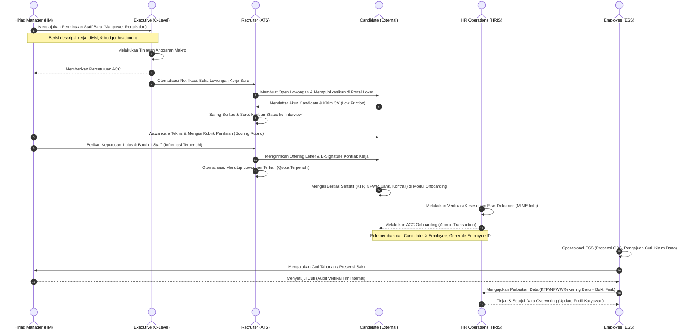

# siCare HRMS & Payroll - Rencana Kerja Harian AI (Role-Based Task Board v2)

> [!IMPORTANT]
> File ini berisi panduan implementasi teknis super-lengkap, pembagian tugas per hari yang terfokus pada 1 Role utama per hari, daftar menu wajib per role, alur kolaborasi antar-peran (MNC standard), aturan absolut Superadmin, serta instruksi kualitas penulisan kode berstandar internasional.
> **PANDUAN INI BERSIFAT MUTLAK UNTUK DIJADIKAN INSTRUKSI KEPADA ASISTEN AI CODING SAAT MULAI BEKERJA.**

---

## ⚠️ INSTRUKSI KUALITAS KODE INTERNASIONAL
Setiap baris kode yang ditulis wajib mengikuti kaidah-kaidah berikut:
1. **Clean Code & OOP (Object-Oriented Programming)**:
   * Terapkan prinsip **SOLID** (*Single Responsibility, Open/Closed, Liskov Substitution, Interface Segregation, Dependency Inversion*).
   * Gunakan pola arsitektur **MVC (Model-View-Controller)** yang ketat. Pisahkan logika kueri database (Model), logika bisnis (Controller), dan render tampilan antarmuka (View).
   * Terapkan **DRY** (*Don't Repeat Yourself*) dengan memanfaatkan *Service Layer* atau *Helper Classes* untuk operasi berulang (seperti konversi tanggal, validasi file, enkripsi data).
2. **SPA (Single Page Application) Hybrid & API-Driven Architecture**:
   * **Koneksi Frontend ke Backend Wajib Via API**: Seluruh komunikasi data, pertukaran payload, pengambilan data (*data-fetching*), dan mutasi data antara antarmuka (Frontend) ke sistem logik bisnis (Backend) **WAJIB** menggunakan endpoint RESTful API internal. 
   * Interaksi dinamis seperti perpindahan tab menu, konfirmasi aksi, pengisian formulir, penyeretan papan Kanban ATS, dan pencarian data wajib diproses menggunakan **AJAX/Fetch API** ke endpoint API tanpa me-refresh seluruh halaman secara kaku.
   * Modul antarmuka wajib merespons perubahan status secara instan di sisi client demi memelihara nuansa visual premium global.
3. **Prepared Statements & Anti SQL Injection**:
   * Dilarang keras melakukan kueri mentah dengan string interpolasi langsung. Seluruh binding parameter database menggunakan PDO parameterized statements.
4. **Konsistensi Konstitusi Dokumen & Cross-Check (Strict)**:
   * **Wajib Cross-Check**: Setiap kali AI menerima perintah pengerjaan fitur, AI **wajib membaca dan memeriksa** terlebih dahulu file panduan utama ([guide-for-ide.md](file:///d:/Server/WebApp/siCare/guide-for-ide.md)), aturan keamanan ([security.md](file:///d:/Server/WebApp/siCare/security.md)), panduan visual ([design.md](file:///d:/Server/WebApp/siCare/design.md)), serta rencana tugas ini ([task.md](file:///d:/Server/WebApp/siCare/task.md)).
   * **Konfirmasi Ketidaksesuaian**: Jika terdapat instruksi pengerjaan dari user yang kontradiktif dengan aturan baku dalam ketiga file tersebut, AI **WAJIB MENANYAKAN DAN MENGONFIRMASI TERLEBIH DAHULU** kepada user sebelum mengeksekusi kode!
   * **Perombakan Desain Massal**: Jika disepakati terjadi perubahan arah atau penyesuaian visual, AI wajib melakukan perombakan menyeluruh pada seluruh komponen antarmuka yang terdampak agar konsistensi visual premium tetap seragam dan terjaga.
5. **Efisiensi & Performa Aplikasi Ringan (Lightweight Standar)**:
   * Kode wajib dioptimalkan dengan struktur ringan, bebas dari library eksternal yang tidak perlu (*bloatware*).
   * Kueri SQL wajib efisien (meminimalkan kueri berulang N+1) serta mengimplementasikan optimasi caching SimpleCache pada data master yang statis demi menjaga kecepatan muat halaman yang gegas.

---

## ⚠️ VERIFIKASI GIT STATUS & MIGRASI PRODUKSI AMAN (WAJIB)
1. **Pemeriksaan Git**: Sebelum memulai tugas harian, jalankan perintah `git status` untuk memastikan codebase bersih.
2. **Migrasi Aman (No Data Loss)**: Seluruh perintah SQL DDL wajib dibungkus dengan klausul pengaman `CREATE TABLE IF NOT EXISTS` dan `ALTER TABLE ... ADD COLUMN IF NOT EXISTS` agar basis data produksi sebelumnya tidak hancur dan **tidak ada satu pun data karyawan lama yang terhapus**.

---

## 🔗 KORELASI ANTAR ROLE & ALUR INTEGRASI FITUR (MNC GLOBAL FLOW)

Aplikasi siCare HRMS & Payroll mengikat seluruh peran secara vertikal dan horizontal dalam alur bisnis yang dinamis dan terintegrasi:



---

## 🛠️ ATURAN KHUSUS MUTLAK: ROLE SUPERADMIN (THE GUARDIAN)
Untuk menghindari penyalahgunaan, peran `superadmin` dikonfigurasi dengan aturan teknis yang sangat spesifik dan aman:
1. **Otoritas Manajemen Absolut**: Memiliki semua akses manajemen yang dimiliki role `admin`, `hr_ops`, `recruiter`, dan `hiring_manager` (termasuk kontrol struktur divisi 5 level, verifikasi onboarding, manajemen master karyawan, serta pengaturan server global).
2. **Tanpa Intervensi Jalur Persetujuan**: Perubahan data yang dilakukan langsung oleh `superadmin` tidak melalui antrean `approval_requests`, melainkan langsung merubah database.
3. **Pelaporan Aktivitas Wajib**: Sebagai kompensasi atas otoritas tertingginya, **setiap aktivitas** CRUD, penghapusan log, atau mutasi global yang dilakukan oleh `superadmin` **WAJIB dicatat secara otomatis ke dalam antrean dashboard pengawasan milik role `executive`** (Komite Audit/C-Level) secara transparan dan tidak dapat disembunyikan.

---

## 📅 DAFTAR MENU WAJIB DAN JADWAL IMPLEMENTASI HARIAN

```
+---------------------------------------------------------------------------------+
| HARI 1: Superadmin  ==> HARI 2: Executive  ==> HARI 3: Recruiter                |
| HARI 4: Hiring Mgr  ==> HARI 5: HR Ops     ==> HARI 6: Employee  ==> HARI 7: Cand |
+---------------------------------------------------------------------------------+
```

Setiap hari fokus penuh pada pembuatan modul, backend controller, database updates, dan UI view yang berkaitan dengan **1 PERAN SAJA** secara berurutan.

### 📅 HARI 1: IMPLEMENTASI ROLE - SUPERADMIN (IT & SYSTEM GUARDIAN)
*Fokus pada pembuatan infrastruktur global, manajemen database transaksi aman, dan otorisasi master.*
*   **Daftar Menu Wajib**:
    1.  **Dashboard Superadmin**: Statistik server, status database, sisa disk storage.
    2.  **User & RBAC Manager (SPA)**: Manajemen akun internal (Admin, HR, Manager, Executive) beserta alokasi hak akses peran (1-8).
    3.  **Global System Settings**: Pengaturan parameter SMTP Email, limitasi ukuran berkas (10MB), dan log rotasi.
    4.  **Audit Logs & Clean Log Console**: Tampilan audit log sistem dengan tombol pembersihan aman.
    5.  **Menu & Privilege Mapping**: Modul khusus (Hanya Superadmin/Admin) untuk mendaftarkan menu (`system_menus`) dan menautkannya ke departemen eksekutif (`department_menu_privileges`).
*   **Checklist Implementasi**:
    *   [ ] **Tugas 1.1**: Verifikasi `git status` dan buat migrasi aman tabel database (`users`, `user_profiles`, `audit_logs`, `system_menus`, `department_menu_privileges`) menggunakan UUID v4.
    *   [ ] **Tugas 1.2**: Implementasi Controller `AuditLogController` dengan skrip perlindungan mutlak (menyisakan log kesaksian superadmin saat log dibersihkan).
    *   [ ] **Tugas 1.3**: Konfigurasi global Middleware pengaman (CSRF, Prepared Statements Parameter Binding, dan XSS Escape filter).
    *   [ ] **Tugas 1.4**: Membuat antarmuka pemetaan menu dinamis (Menu Mapping) untuk mengatur hak akses fitur khusus bagi setiap entitas eksekutif.
    *   [ ] **Tugas 1.5**: Membuat integrasi pelaporan otomatis seluruh jejak aksi superadmin ke dashboard monitoring eksekutif.

---

### 📅 HARI 2: IMPLEMENTASI ROLE - EXECUTIVE (C-LEVEL & COMITE AUDIT)
*Fokus pada dashboard makro, pelaporan finansial rahasia, audit komite, persetujuan headcount, dan akses 20 Entitas C-Level.*
*   **Daftar Menu Wajib**:
    1.  **C-Level Macro Dashboard (SPA)**: Grafik real-time *Turnover Rate* karyawan, *Cost per Hire* tahunan, dan persentase kehadiran global perusahaan.
    2.  **Budget & Requisition Approval**: Daftar antrean pengajuan lowongan baru (*Manpower Requisition*) dari manajer departemen untuk di-ACC atau ditolak.
    3.  **Immutable Audit Trail Explorer**: Modul khusus Komite Audit untuk mencari dan menyaring aktivitas `superadmin`, `admin`, dan dewan direksi secara transparan.
    4.  **Confidential Payroll View**: Hak akses terbatas untuk melihat rekapitulasi penggajian perusahaan skala besar.
    5.  **Board Audit & Attendance Console**: Modul khusus dewan komisaris memantau log kehadiran rapat eksekutif, tunjangan dewan direksi, dan log fiduciary.
    6.  **Dynamic Department Menus**: Menu yang di-render secara dinamis berdasarkan nilai tabel `department_menu_privileges` milik `department_id` C-Level.
*   **Checklist Implementasi**:
    *   [ ] **Tugas 2.1**: Verifikasi `git status`. Membuat migrasi tabel `approval_requests` untuk mendukung workflow approval serta men-setup 20 entitas departemen C-Level (is_executive_entity = TRUE).
    *   [ ] **Tugas 2.2**: Implementasi analitik data makro (query agregasi SQL hemat memori) untuk memetakan turnover rate dan rekap finansial payroll.
    *   [ ] **Tugas 2.3**: Membuat modul antarmuka visual komite audit dengan pencarian real-time (AJAX) pada log sistem.
    *   [ ] **Tugas 2.4**: Membuat backend API dan visual panel "Board Audit Console" untuk kebutuhan pengawasan dewan komisaris terhadap C-Level.
    *   [ ] **Tugas 2.5**: Membuat Middleware/Interceptor untuk membaca hak akses dari `department_menu_privileges` dan me-render (menampilkan) menu sidebar sesuai departemen C-Level (CEO, CTO, dsb) secara spesifik.


---

### 📅 HARI 3: IMPLEMENTASI ROLE - RECRUITER (TALENT ACQUISITION & ATS MANAGER)
*Fokus pada siklus lowongan kerja, penjadwalan wawancara, manajemen Kanban ATS, dan offering letter.*
*   **Daftar Menu Wajib**:
    1.  **Job Vacancies Manager**: Form draf lowongan kerja, kualifikasi, deskripsi, dan integrasi penutupan lowongan otomatis.
    2.  **Kanban ATS Board (SPA)**: Papan visual seret-dan-lepas status kandidat (`Applied` -> `Screening` -> `Shortlisted` -> `Interview` -> `Offering` -> `Hired`).
    3.  **Interview Scheduler**: Menu kalender koordinasi untuk mengagendakan pertemuan kandidat dengan Hiring Manager.
    4.  **Offering & Contract Center**: Pengunggahan berkas offering letter dan pelacakan e-signature kontrak digital.
*   **Checklist Implementasi**:
    *   [ ] **Tugas 3.1**: Verifikasi `git status` dan buat migrasi tabel `job_posts` dan `job_applications`.
    *   [ ] **Tugas 3.2**: Implementasi modul Kanban Board interaktif menggunakan Vanilla JS Drag-and-Drop dengan *backend request* AJAX untuk perubahan status pelamar secara instan.
    *   [ ] **Tugas 3.3**: Membuat logika penutupan otomatis status lowongan kerja setelah Hiring Manager melaporkan kuota staff telah terpenuhi.

---

### 📅 HARI 4: IMPLEMENTASI ROLE - HIRING MANAGER (DEPARTMENT LEAD)
*Fokus pada pengajuan staf baru, isolasi data horizontal, penilaian wawancara, dan persetujuan internal.*
*   **Daftar Menu Wajib**:
    1.  **Manpower Requisition Form**: Formulir pengajuan staff baru ke Executive (deskripsi kerja, justifikasi bisnis, budget).
    2.  **Candidate Assessment Center**: Menu evaluasi CV dan input rubrik penilaian wawancara teknis (*Scoring Rubric*) pelamar di bawah departemennya.
    3.  **Team List Dashboard**: Basis data seluruh staf di divisinya (terbatas hanya divisi miliknya dan sub-divisi di bawahnya).
    4.  **Internal Approvals Manager (SPA)**: Persetujuan presensi, lembur, klaim dana, dan cuti tahunan milik anggotanya.
    5.  **Personal ESS Portal**: Akses mandiri untuk manajer absensi GPS, pengajuan cuti pribadi, dan unduh slip gaji (diaudit langsung vertikal ke atas oleh Direktur/Executive).
*   **Checklist Implementasi**:
    *   [ ] **Tugas 4.1**: Verifikasi `git status` dan buat database updates tabel `departments` (sistem 5 level) dan `employment_history`.
    *   [ ] **Tugas 4.2**: Implementasi filter pengaman *database query* (isolasi horizontal) untuk membatasi kueri data hanya pada karyawan di bawah departemen HM terkait.
    *   [ ] **Tugas 4.3**: Membuat formulir interaktif rubrik penilaian wawancara kandidat beserta pengiriman status "Terpenuhi" ke modul recruiter.
    *   [ ] **Tugas 4.4**: Mengaktifkan modul ESS mandiri khusus manajer dan menghubungkan alur persetujuannya ke level Executive/Direktur di atasnya.


---

### 📅 HARI 5: IMPLEMENTASI ROLE - HR OPERATIONS (HRIS & PAYROLL SPECIALIST)
*Fokus pada aktivasi onboarding, enkripsi data legal, validasi berkas correction, dan modul payroll.*
*   **Daftar Menu Wajib**:
    1.  **Onboarding Verifier**: Antrean verifikasi berkas kandidat baru yang telah menandatangani kontrak (KTP, NPWP, Rekening).
    2.  **Core HRIS Master**: Manajemen profil lengkap karyawan aktif (mutasi departemen 5 level, status kontrak).
    3.  **Correction Queue (SPA)**: Dashboard verifikasi data administratif karyawan yang terkunci (ACC data correction).
    4.  **Payroll & Tax Processor**: Pengolahan gaji bulanan, BPJS Kesehatan/TK, potongan cuti tidak dibayar, insentif, dan slip gaji PDF.
    5.  **Personal ESS Portal**: Akses mandiri untuk staf HR melakukan absensi GPS, pengajuan cuti pribadi, dan unduh slip gaji (tanpa persetujuan mandiri; alur persetujuan lembur/cutinya dilempar vertikal langsung ke HR Manager/Director).
*   **Checklist Implementasi**:
    *   [ ] **Tugas 5.1**: Verifikasi `git status`. Implementasi database transaksi atomik `beginTransaction()` untuk memindahkan data Onboarding dari `candidate` menjadi `employee`.
    *   [ ] **Tugas 5.2**: Membuat antarmuka pemutasi divisi karyawan dengan cascading dropdown bertingkat 5 level berbasis AJAX.
    *   [ ] **Tugas 5.3**: Mengembangkan modul generator slip gaji bulanan digital berformat PDF terenkripsi dan rekap potongan pajak PPh 21.
    *   [ ] **Tugas 5.4**: Membuat backend pengamanan otomatis yang menyembunyikan tombol ACC ketika staf HR mengakses portal ESS miliknya sendiri, serta mengarahkan alur persetujuannya ke level atasan HR.


---

### 📅 HARI 6: IMPLEMENTASI ROLE - EMPLOYEE (EMPLOYEE SELF-SERVICE / ESS)
*Fokus pada presensi GPS, pengunduhan slip gaji rahasia, klaim reimbursement, dan perbaikan data.*
*   **Daftar Menu Wajib**:
    1.  **ESS Dashboard Profile**: Kartu identitas, Employee ID, jabatan, divisi, dan sisa kuota cuti tahunan.
    2.  **GPS Attendance Console**: Tombol presensi masuk/keluar terikat dengan deteksi lokasi browser (GPS) dan riwayat kehadiran harian.
    3.  **Leaves & Claims Manager**: Pengajuan cuti tahunan, cuti sakit (wajib upload surat dokter max 10MB), serta pengajuan reimburse kuitansi medis/operasional.
    4.  **Data Correction Request Form**: Modul pengajuan perubahan data administratif KTP/NPWP/Rekening Bank baru beserta unggahan dokumen pembuktian.
    5.  **Financial Slip Vault**: Brankas privat pengunduhan slip gaji bulanan dan form pajak 1721-A1.
*   **Checklist Implementasi**:
    *   [ ] **Tugas 6.1**: Verifikasi `git status` dan implementasi pemanfaatan Geolocation API pada peramban untuk presensi GPS.
    *   [ ] **Tugas 6.2**: Membuat alur upload file kuitansi dan surat sakit dengan validasi ketat binary finfo sisi server.
    *   [ ] **Tugas 6.3**: Mendesain visual CSS modern premium untuk ESS Profile sesuai aturan visual malam [design.md](file:///d:/Server/WebApp/siCare/design.md).

---

### 📅 HARI 7: IMPLEMENTASI ROLE - CANDIDATE (EXTERNAL PORTAL)
*Fokus pada portal karir publik, pelacakan status rekrutmen, dan formulir wizard onboarding.*
*   **Daftar Menu Wajib**:
    1.  **Public Career Portal**: Pencarian lowongan kerja aktif berdasarkan kualifikasi dan lokasi penempatan.
    2.  **Job Application Status Tracker**: Memantau pergerakan lamaran kerja (`Applied` -> `Interview` -> `Offering` -> `Rejected`).
    3.  **Offering E-Signature Console**: Lembar tinjauan Offering Letter resmi beserta area input tanda tangan digital.
    4.  **Onboarding Wizard Forms**: Formulir interaktif bertahap untuk pengunggahan dokumen legalitas (KTP, NPWP, Buku Rekening Bank) sebelum diaktifkan menjadi karyawan.
*   **Checklist Implementasi**:
    *   [ ] **Tugas 7.1**: Verifikasi `git status`. Membuat antarmuka portal lowongan kerja luar yang SEO-friendly dan responsif.
    *   [ ] **Tugas 7.2**: Membuat modul wizard onboarding dengan input dinamis dan proteksi file shell upload.
    *   [ ] **Tugas 7.3**: Implementasi canvas e-signature berbasis HTML5 untuk penandatanganan kontrak kerja digital pelamar.
